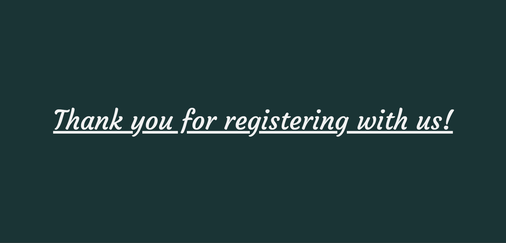
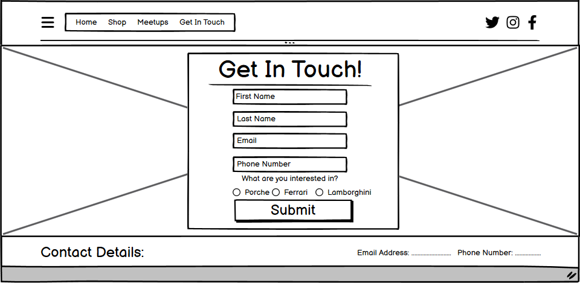

# Peter's Dealership

## Purpose of the Project

**Description:**
The purpose of my website is to create a user-friendly and visually appealing static website for my car dealership. The website is designed in 3 primary sections. The home page, a shop section to showcase the inventory and outline the specification of our cars in stock, and a meet-up section that provides a oppurtunity for clients to soacalise and show off their new bought rides. Peter's Dealership is a website with an intuitive interface for users to get-to-know, browse and become members of our buisness. This README will guide you through the project's key aspects and its development process.

**Why This Project:**
My goal is to establish an online presence, attract potential customers, and facilitate the process of enlisitng new members and inorming them about the cars we have for sale.

**Project Objectives:**

- Provide a user-friendly interface.
- Showcase our cars in an appealing way.
- Enable users to become members and make inquieries about the cars.
- Make the website scalable and supported across multiple devices and screen widths.
- Make the website interactive by displaying a google maps iframe.
  
## User Stories

**Current User Stories:**

1. As a prospective car buyer, I want to view detailed information and high-quality images of the available cars.
2. As a visitor, I want to easily navigate the website and find relevant information.
3. As a potential customer, I want to inquire about a specific car or schedule a meeting with the dealership.
4. As a car enthusiast, I want to be able to soacalise and meet others like me to show off our hard earned cars.
5. As a visitor, I want to easily find contact information, including the dealership's address, phone number, and email, so I can reach out for inquiries or assistance.

**Future User Stories:**

1. As a car enthusiast, I want to receive notifications about new arrivals or special promotions, so I can stay updated on the latest offerings from the dealership.
2. As a returning customer, I want the option to save favorite cars or my search preferences for a personalized and convenient experience.
3. As a prospective buyer, I want to read customer reviews and testimonials to gain insights into the experiences of others who have purchased cars from the dealership.

## 3. Features

**Key Features:**

- Navigation: Easy-to-use navigation for seamless user experience whilst orientating the website. This feature displays the navigation links, as well as the brand logo and social media links.

- Home Section: An introduction to the dealership which includes a hero-image and a jumbotron prompting the user to become a member. If the user clicks the button they are redirected to our form page.

- Shop Section: Showcase of the three available cars with images and specifation of the car model, make, engine size etc.There is also a buy now button which redirects users to the coming-soon page.

- Meet-Up Section: Information on where the dealership resides and where we host car-shows. Minimum requirements and event details are also displayed.

- Form Page: Users can submit their details including First Name, Last Name, Email, Phone Number and brand of car they are interested in, to become a member and potential client. Once submited they will be redirected to the submission page.

- Footer Section: In the footer users can find the brand name and logo, copyright information and contact details.

## Future Features

**Planned Future Features:**

- Implement a user registration and login system.
- Develop a check out page so users can purchase vehicles.
- Include a stock counter that displays thhe amount of vehicles we have of that model in stock.
- Construct a gallery page so we become more trustworthy with new customers.

## User Experience Design Features

**Intuitive Scroll:**

- Each page is designed to end slightly before the end of the browsers viewing height. This is done so that the following page's heading is visible from the previous page. This entices users to keep scrolling down and view the following pages. It also disproves the misconception that the website finishes there. I have implemented this for all my supported devices.

**Typography:**

- Primary Font: [courgette] I chose courgette because of it's simplistic yet stylish looks, its easy to read and draws attention. "Courgette communicates warmth, artfulness, and creativity. It is comforting yet expressive. Courgette is perfect for brands looking to add a creative, comforting, DIY voice." - Typogram

- Secondary Font: [sans-serif] I chose my secondary font as sans-serif as its the basic font built across all browsers and supported everywhere. If by some reason my main font doesn't load I can always rely and depend on sans-serif.

**Color Scheme:**

- Primary Color: [#2f4f4f] I Chose DarkSlateGray because it holds significant importance in graphic design as it enhances visual impact. Its depth creates contrast, making other elements stand out and catch the viewer's attention.
  
- Secondary Color: [#f2f2f2] I chose my secondary colour for it's neutrality and simplicity. Light gray is a neutral colour that can create a clean and simple aesthetic. It doesn't distract from the content and is often used as a background colour to make other elements stand out. this is why it can be paired perfectly with the DarkSlateGray to emphasise content.

## Wireframes

**Wireframes:**

- Home Section Wireframe: 

- Shop Section Wireframe: 

- Meetup Section Wireframe: 

- Form Section Wireframe: 

## Technology

**Languages:**

- **HTML:** Used to structure the contents fo my website.
- **CSS:** Used to style the content of my website.

**Frameworks and Add-Ons:**

- **Bootstrap:** Used to make the website scalable across multiple screen sizes.
- **Fontawsome:** Used to integrate icons into my website.
- **Google Fonts:** Used to apply non-included fonts onto my text.

**Additional:**

- **Codeanywhere:** My Integrated Development Environment.
- **Git and Github:** Used Git for source code managment and github for version control.
- **GitPages:** For deployment of my website.

## Testing

**W3C Validator:**

- HTML 
- CSS 

**User Stories:**

- A User wants to sign up to become a member, when on the website they scroll down to the home page, navigate themselves onto the jumbotron and click the "Become A Member!" button.  Once Clicked they will be redirected to the form Page. In order for a user to become a member they need to fill in the required fields: First Name, Last Name, Email and Phone Number.  Once that is complete they can finish the form by picking which car they are most interested by and submit the form using the "Submit!" button. Finaly, they will be redirected to a thank you page. 

**Fixed Bugs:**

1. My CSS nor any of my images wouldn't load because my source paths included a "/" before the path e.g. href="/assets/css/style.css">. I fixed this by trying diffrent file paths and stumbled accross the problem, i then removed all the prefixed "/" and my site finally rendered the CSS and images.
2. I couldn't figure out why my porsche jumbotron was floating to the left.  I then realized that in a CSS file there is specificity and that my porsche jumbotron wasnt getting the float:right; property because it had a lower specificity. I fixed this by targetting the element with a higher order of specificty such as a ID. 

**Supported Screen Sizes:**

- Mobile Phones and Small Tablets (Breakpoint: 320px to 768px).
- Large Tablets and Small Laptops (Breakpoint: 768px to 1400px).
- Large Laptops and Small Monitors (Breakpoint: 1400px to 1645px).
- Large Monitors and Tv's (Breakpoint: 1645px +).

## Deployment

The Site was Deployed on GitHub Pages. This is the link <https://github.com/PeterGarvanski/PetersDealership.git>
